# muni 사용자 가이드

문서를 만들고, 함께 고치고, 필요한 형식으로 내보내는 사람을 위한 안내입니다.
설치·설정·계정 발급은 [관리자 가이드](ADMIN_GUIDE.md)에 있습니다.

이 문서의 화면은 muni v0.36.0 을 데모 데이터로 채워 실제로 찍은 것입니다.

## 1. muni 가 하는 일

muni 는 사내에서 돌리는 문서 협업 도구입니다. 워드나 한글 파일을 주고받는 대신, 브라우저에서
문서를 만들고 여러 사람이 동시에 고칩니다. 고친 내역은 버전으로 쌓이고, 문장마다 댓글을 달 수
있으며, 다 된 문서는 DOCX·PDF·한글(HWPX)·Markdown·HTML·TXT 로 내보냅니다.

밖에서 온 파일도 그대로 읽습니다. PDF·DOCX·HWP·HWPX·Markdown·TXT·HTML 을 올리면 제목·목록·표·
서식·그림이 살아 있는 문서로 들어옵니다. 평문으로 무너뜨려 붙여 넣는 것이 아니라 문서 구조를
그대로 옮기므로, 가져온 뒤에 다시 편집하고 다시 내보낼 수 있습니다.

문서는 **워크스페이스** 안에 있습니다. 자기 것만 두는 개인 워크스페이스가 하나 있고, 팀이 함께
쓰는 워크스페이스에 초대받아 들어갑니다. 누가 무엇을 볼 수 있는지는 문서마다 정합니다.

## 2. 처음 5분

### 로그인

받은 아이디(또는 이메일)와 비밀번호로 들어갑니다. 회사에서 Keycloak SSO 를 붙여 두었다면
「Keycloak SSO로 로그인」 단추가 함께 보입니다.

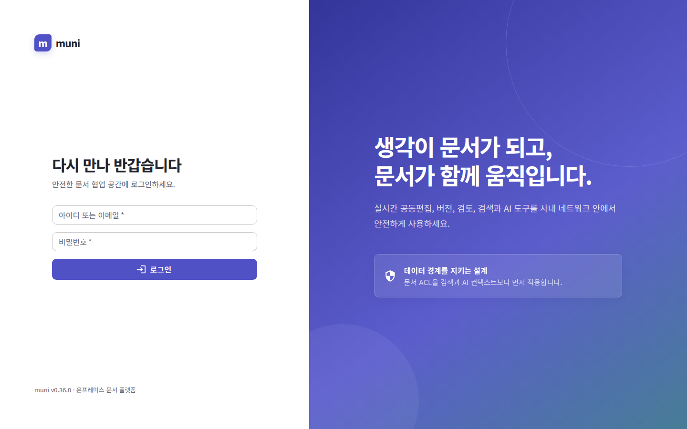

관리자가 만들어 준 비밀번호로는 로그인만 됩니다. 처음 들어가면 비밀번호를 바꾸라는 화면이 먼저
나오고, 바꾸기 전까지 다른 화면은 열리지 않습니다.

### 홈에서 시작하기

로그인하면 홈이 열립니다. 최근에 손댄 문서가 카드로 놓여 있어 바로 이어서 일할 수 있습니다.

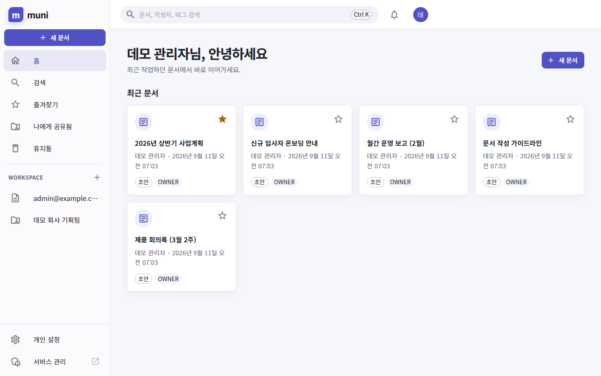

왼쪽 메뉴는 이렇게 나뉩니다.

| 메뉴 | 무엇이 보이나 |
| --- | --- |
| 홈 | 최근에 열거나 고친 문서 |
| 검색 | 제목·본문·작성자·태그로 찾기 |
| 즐겨찾기 | 별표를 눌러 둔 문서 |
| 나에게 공유됨 | 다른 사람이 직접 공유한 문서 |
| 휴지통 | 지운 문서. 복원할 수 있습니다 |
| WORKSPACE | 내 개인 워크스페이스와 초대받은 팀 워크스페이스 |

「검토 및 승인」은 관리자가 검토·승인 기능을 켜 둔 서비스에서만 메뉴에 나타납니다.

### 첫 문서 만들기

**새 문서**를 누르면 제목과 워크스페이스·폴더를 묻습니다. 같은 창에서 파일을 골라 가져올 수도
있습니다 — 가져오면 그 파일이 곧 새 문서가 됩니다.

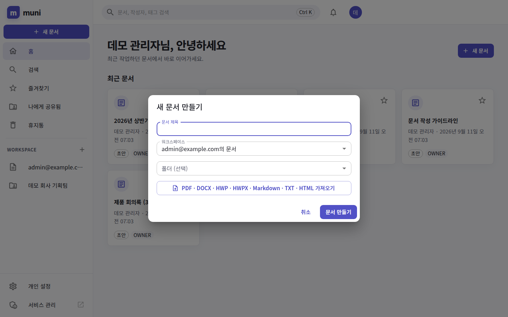

만들면 곧바로 편집기가 열립니다. 저장 단추는 없습니다. 치는 동안 계속 저장되고, 위쪽에
「저장됨」이 뜹니다.

### 함께 보게 하기

편집기 위쪽 **공유**를 누르고 사람을 찾아 권한(조회·댓글·편집)을 골라 추가합니다. 계정이 없는
사람에게 보여 줘야 하면 같은 창에서 공개 링크를 만듭니다.

여기까지가 muni 로 하는 일의 전부입니다. 나머지는 그 위에 얹힌 편의입니다.

## 3. 화면별 사용법

### 워크스페이스

팀 문서가 폴더로 정리되어 있습니다. 왼쪽에서 폴더를 고르면 그 폴더의 문서만 보입니다.

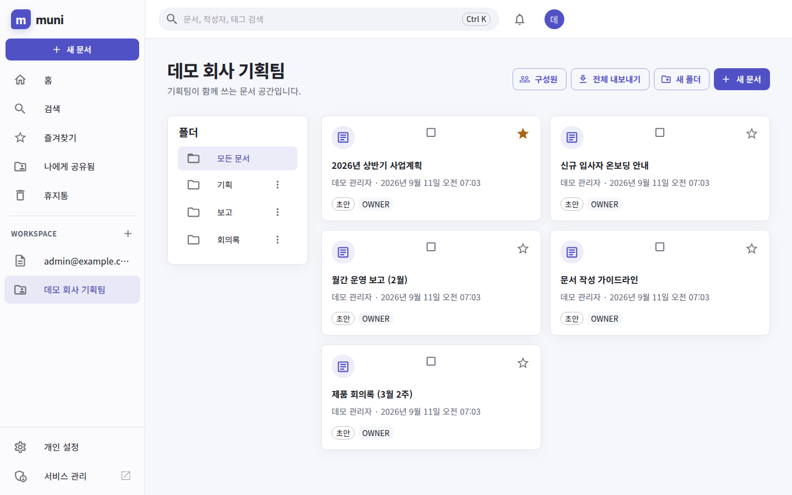

- **새 폴더** — 폴더를 만들고, 폴더의 ⋮ 로 이름을 바꾸거나 지웁니다.
- **구성원** — 이 워크스페이스를 함께 쓰는 사람을 봅니다. 구성원 추가는 워크스페이스 소유자나
  관리자(MANAGER) 역할일 때 할 수 있습니다.
- **전체 내보내기** — 워크스페이스의 문서를 한 번에 zip 으로 받습니다.
- 카드의 네모를 체크하면 고른 문서를 한꺼번에 다른 폴더로 옮기거나 태그를 붙이고 뗄 수 있습니다.
- 목록 화면에 파일을 **끌어다 놓으면** 그대로 새 문서로 가져옵니다. 보고 있던 폴더가 미리
  골라져 있습니다.

### 편집기

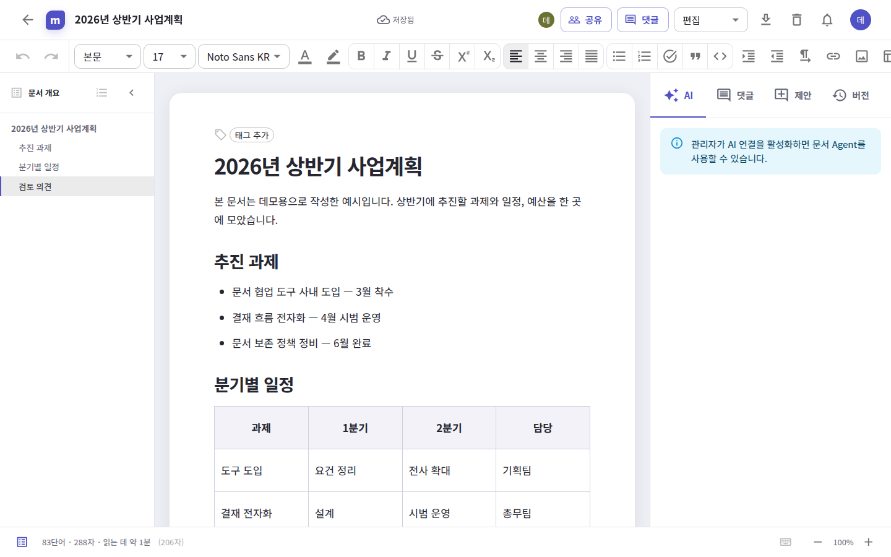

- **위쪽 줄**: 문서 제목, 저장 상태, 공유, 댓글, 편집/보기 전환, 내보내기(⤓), 휴지통.
- **서식 줄**: 제목 단계와 글꼴·크기, 굵게·기울임·밑줄·취소선·위 첨자·아래 첨자, 글자 색과 강조
  색, 정렬, 글머리표·번호·체크 목록, 인용, 코드, 들여쓰기, 링크, 이미지, 표, 각주, 페이지
  나누기, 가로 구분선.
- **왼쪽 문서 개요**: 제목 단계를 따라 자동으로 만들어집니다. 항목을 누르면 그 자리로 갑니다.
- **아래 상태줄**: 단어 수·글자 수·읽는 데 걸리는 시간, 단축키 도움말(`Ctrl+/`), 확대·축소.
- 본문에서 `/` 를 치면 삽입 메뉴가 열립니다 — 제목 1~3, 본문, 글머리 기호 목록, 번호 매기기
  목록, 체크리스트, 인용, 코드 블록, 도형 (mermaid), 이미지, 파일 내용 넣기, 가로 구분선,
  페이지 나누기, 목차, 오늘 날짜. `#` 과 공백으로 제목을, `-` 과 공백으로 목록을 만들 수도
  있습니다.

문서에 파일을 끌어다 놓으면 **놓은 자리에** 그 내용이 들어옵니다. 실행 취소 한 번으로 되돌아
갑니다.

### 오른쪽 패널 — 댓글

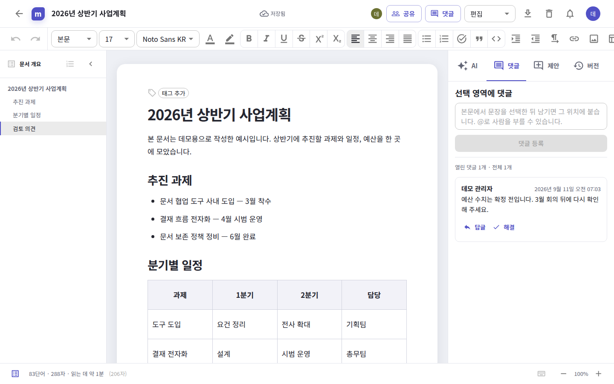

본문에서 문장을 선택한 뒤 댓글을 남기면 그 자리에 붙습니다. `@` 로 사람을 부르면 알림이 갑니다.
정리된 이야기는 **해결**로 닫고, 필요하면 다시 엽니다.

### 오른쪽 패널 — 버전

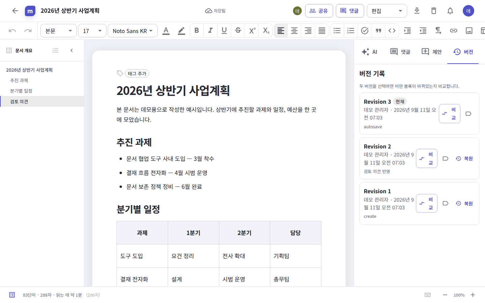

저장될 때마다 개정이 쌓입니다. 두 개정을 고르고 **비교**를 누르면 어떤 블록이 추가·삭제·변경·
이동되었는지 보여 주고, 바뀐 블록 안에서는 어느 낱말이 달라졌는지까지 표시합니다. **복원**은
그 시점의 내용을 현재 문서로 되돌립니다(되돌린 것도 새 개정으로 남습니다). 개정에 이름을 붙여
두면 나중에 찾기 쉽습니다.

「AI」·「제안」·「첨부」 탭도 같은 자리에 있습니다. AI 는 관리자가 연결을 켜 둔 서비스에서만
동작합니다. 제안 탭에는 동료나 AI 가 낸 변경 제안이 모이고, 받아들이면 본문에 적용됩니다.

### 내보내기

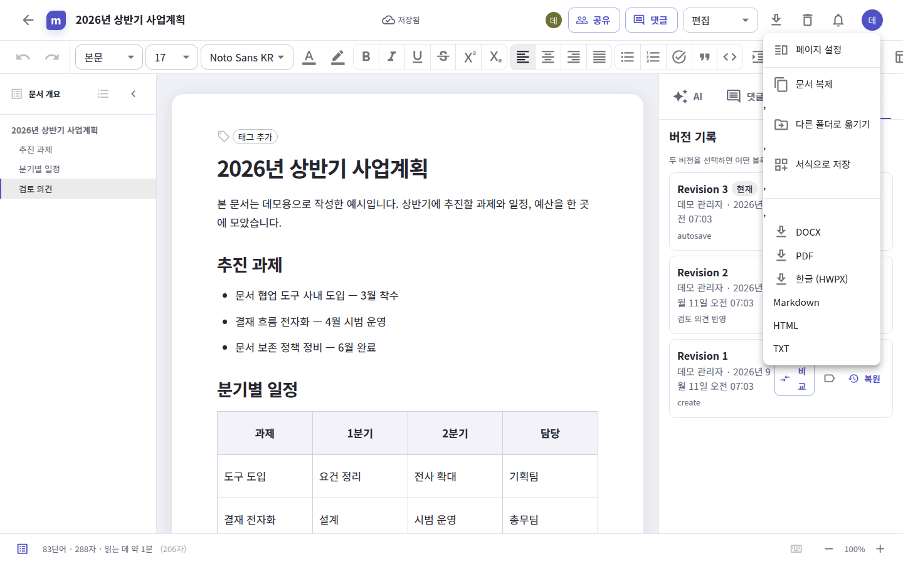

같은 메뉴에 문서 자체를 다루는 항목도 함께 있습니다.

| 항목 | 하는 일 |
| --- | --- |
| 페이지 설정 | 머리말·꼬리말·용지 방향 |
| 문서 복제 | 같은 내용의 새 문서 |
| 다른 폴더로 옮기기 | 워크스페이스·폴더 이동 |
| 서식으로 저장 | 이 문서를 서식(템플릿)으로 만들어 다음 문서에 재사용 |
| DOCX · PDF · 한글 (HWPX) · Markdown · HTML · TXT | 파일로 내려받기 |

관리자가 발표자료 연동(Ptium)을 설정해 두었다면 이 메뉴에 「발표자료 만들기」가 함께 나옵니다.
관리자 정책으로 PDF·DOCX 내보내기를 막아 둔 서비스에서는 그 항목이 거절됩니다.

### 공유

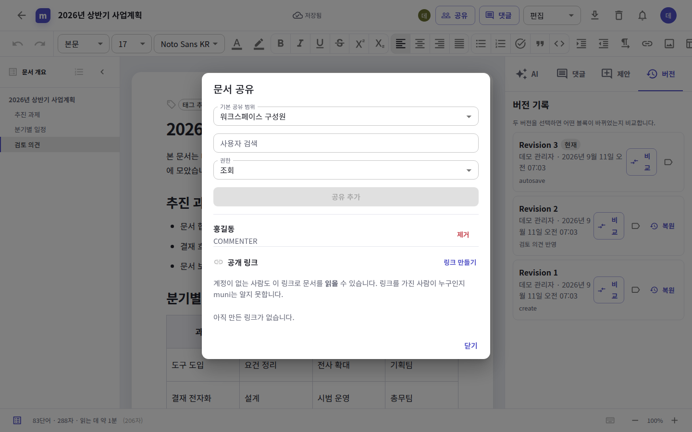

- **기본 공유 범위**: 지정 사용자만 / 워크스페이스 구성원 / 조직 내 모든 사용자.
- **사람별 권한**: 조회(VIEWER)·댓글(COMMENTER)·편집(EDITOR). 문서를 만든 사람이 소유자
  (OWNER)입니다.
- **공개 링크**: 계정이 없는 사람도 링크로 문서를 읽을 수 있습니다. 링크를 가진 사람이 누구인지
  muni 는 알지 못하므로, 필요 없어지면 링크를 지웁니다. 관리자가 공개 링크를 금지해 둔
  서비스에서는 이 부분이 보이지 않습니다.

### 검색과 빠른 이동

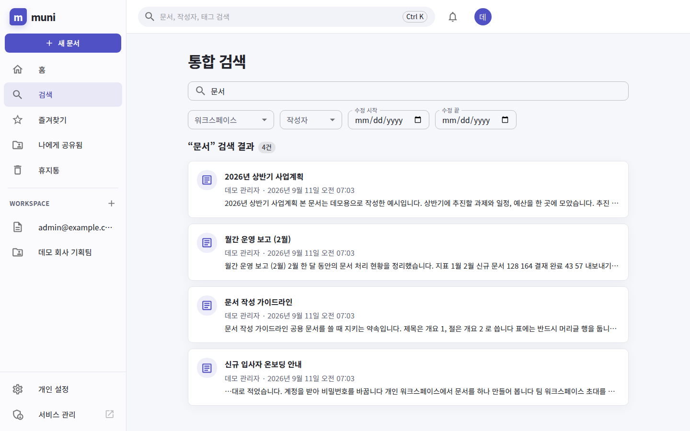

통합 검색은 제목뿐 아니라 본문까지 찾고, 찾은 말이 있는 문장을 함께 보여 줍니다.

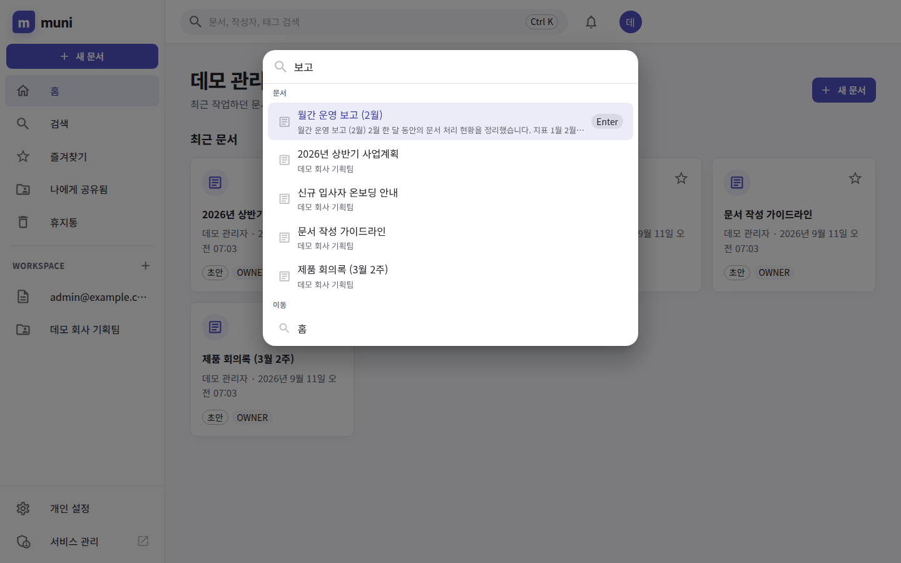

`Ctrl+K`(macOS 는 `⌘K`), 또는 글을 쓰고 있지 않을 때 `/` 를 누르면 빠른 이동 창이 열립니다.
최근 문서와 워크스페이스·주요 화면이 바로 뜨고, 두 글자 이상 치면 본문까지 찾습니다. 방향키와
Enter 로 이동합니다. `추계` 처럼 글자만 순서대로 쳐도 `추진 계획` 을 찾아 줍니다.

### 개인 설정

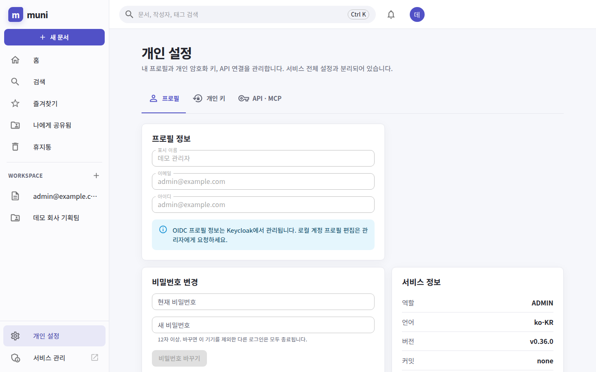

| 탭 | 무엇을 하나 |
| --- | --- |
| 프로필 | 표시 이름 확인, 비밀번호 변경(12자 이상) |
| 개인 키 | 내 개인 암호화 키 회전·폐기 |
| API · MCP | 개인 API 키 발급 — 발급 순간 한 번만 보여 줍니다 |

SSO 로 로그인하는 계정의 프로필은 Keycloak 에서 관리하므로 여기서 바꿀 수 없습니다.

## 4. 자주 하는 작업

### 받은 한글·워드 파일을 muni 문서로 만들기

1. 홈이나 워크스페이스 목록 화면에 파일을 끌어다 놓습니다(또는 **새 문서 → 가져오기**).
2. 워크스페이스·폴더·제목을 확인하고 **가져오기**를 누릅니다.
3. 여러 파일을 한 번에 놓으면 파일마다 문서 하나씩 만들어집니다.

표·목록·그림·머리말·꼬리말·용지 방향까지 함께 들어옵니다. 그림이 없는 스캔본 PDF 는 글자가
없으므로 OCR 을 먼저 하라는 안내가 나옵니다.

### 이미 쓰고 있는 문서에 다른 파일 내용을 끼워 넣기

편집기에서 넣고 싶은 자리에 커서를 두고 파일을 끌어다 놓습니다(붙여넣기도 같습니다). 문단 위에
놓으면 그 문단 뒤에, 여백에 놓으면 문서 끝에 들어갑니다.

### 월말 보고서를 워드로 내보내기

편집기 위쪽 **⤓ → DOCX**. 표의 머리글 행, 각주, 쪽 번호 필드까지 워드가 아는 형태로 나갑니다.
인쇄용 최종본이 필요하면 PDF 를, 한글 오피스로 이어서 작업할 사람에게는 한글 (HWPX) 를 줍니다.

### 잘못 고친 문서를 어제 상태로 되돌리기

오른쪽 **버전** 탭 → 되돌릴 개정의 **복원**. 지금 내용도 개정으로 남아 있으므로 되돌린 뒤에 다시
되돌릴 수 있습니다.

### 실수로 지운 문서 찾기

왼쪽 **휴지통** → 문서의 **복원**. 휴지통은 관리자가 정한 보존 기간이 지나면 자동으로 비워집니다.

### 스크립트나 다른 도구에서 muni 문서 읽기

**개인 설정 → API · MCP** 에서 키를 발급하고 `Authorization: Bearer muni_...` 로 씁니다.
키에 줄 수 있는 범위는 `api:read`, `api:write`, `mcp:read`, `mcp:write`, `ai:use` 입니다.
키는 발급 화면에서 한 번만 보여 주며, 다시 볼 수 없습니다. REST 는 `/api/v1`, 규격은
`/api/openapi.yaml`, MCP 는 `/mcp` 입니다([MCP 안내](MCP.md)).

## 5. 막혔을 때

| 화면에 나오는 말 | 무슨 뜻이고 무엇을 하면 되나 |
| --- | --- |
| 아이디 또는 비밀번호가 올바르지 않습니다. | 오타이거나 계정이 없습니다. 여러 번 틀리면 잠시 로그인을 막습니다 — 몇 분 뒤에 다시 하세요. |
| 사용할 수 없는 계정입니다. | 계정이 정지되었습니다. 관리자에게 문의하세요. |
| 로컬 로그인이 비활성화되어 있습니다. | 이 서비스는 SSO 로만 들어갑니다. SSO 단추를 쓰세요. |
| 로그인이 필요합니다. | 세션이 끊겼습니다. 다시 로그인하면 보던 화면으로 돌아옵니다. |
| 문서에 접근할 권한이 없습니다. | 그 문서를 볼 권한이 없습니다. 문서 소유자에게 공유를 요청하세요. |
| 문서를 찾을 수 없습니다. | 지워졌거나 주소가 잘못되었습니다. 휴지통을 확인해 보세요. |
| 파일은 *N*MB 이하여야 합니다. | 업로드 크기 제한입니다. 한도는 관리자가 정합니다. |
| 가져온 문서가 너무 큽니다. 파일을 나눠서 가져와 주세요. | 한 파일이 문서 하나로 담기에 큽니다. 장별로 나눠 가져오세요. |
| 파일 내용을 읽지 못했습니다 / 가져온 문서를 변환하지 못했습니다 | 파일이 깨졌거나 암호가 걸려 있습니다. 암호를 풀고 다시 올리세요. |
| 관리자 정책에서 PDF(DOCX) 내보내기가 비활성화되어 있습니다. | 서비스 정책입니다. 관리자에게 문의하세요. |
| 이전과 다른 비밀번호를 입력해 주세요. / 현재 비밀번호가 일치하지 않습니다. | 비밀번호 변경 규칙입니다. 새 비밀번호는 12자 이상이어야 합니다. |
| SSO로 로그인하는 계정입니다. 비밀번호는 인증 제공자에서 변경하세요. | Keycloak 에서 바꿉니다. |
| 태그는 문서당 20개까지입니다. | 쓰지 않는 태그를 지우고 다시 붙이세요. |
| 관리자가 AI 연결을 활성화하면 문서 Agent를 사용할 수 있습니다. | 이 서비스에는 AI 가 연결되어 있지 않습니다. 관리자에게 문의하세요. |

문서가 열리지 않거나 화면이 계속 같은 오류를 보이면 관리자에게 **문서 주소와 시각**을 알려
주세요. 관리자는 감사 로그에서 그 요청을 찾을 수 있습니다.

## 6. 용어

| 말 | 뜻 |
| --- | --- |
| 워크스페이스 | 문서를 담는 공간. 개인용 하나와 초대받은 팀 워크스페이스들 |
| 폴더 | 워크스페이스 안에서 문서를 묶는 단위. 중첩할 수 있습니다 |
| 개정(Revision) | 저장될 때마다 쌓이는 문서의 한 시점 |
| 소유자(OWNER) | 문서를 만든 사람. 공유·삭제까지 할 수 있습니다 |
| 편집(EDITOR) · 댓글(COMMENTER) · 조회(VIEWER) | 문서마다 사람에게 주는 권한 |
| 공개 링크 | 계정 없이 문서를 읽을 수 있는 주소 |
| 서식(템플릿) | 새 문서의 출발점으로 쓰는 저장된 문서 |
| 제안 | 본문에 바로 반영되지 않고 받아들여야 적용되는 변경 |
| 검토 및 승인 | 문서를 결재선에 올려 승인을 받는 흐름(관리자가 켜야 보입니다) |
| 문서 Agent | 문서를 읽고 답하는 AI. 내가 볼 수 있는 문서만 봅니다 |
